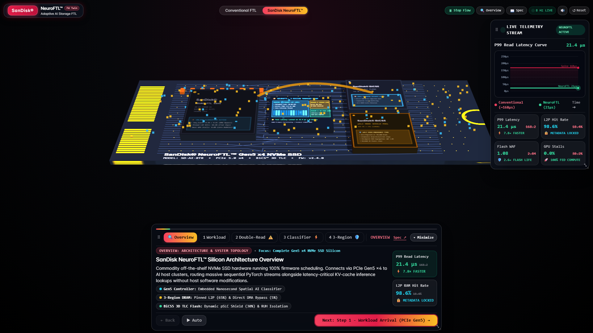
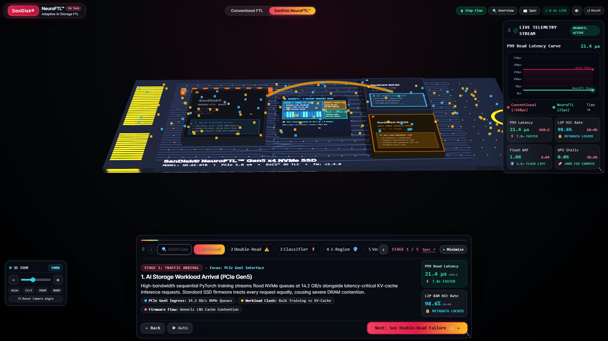
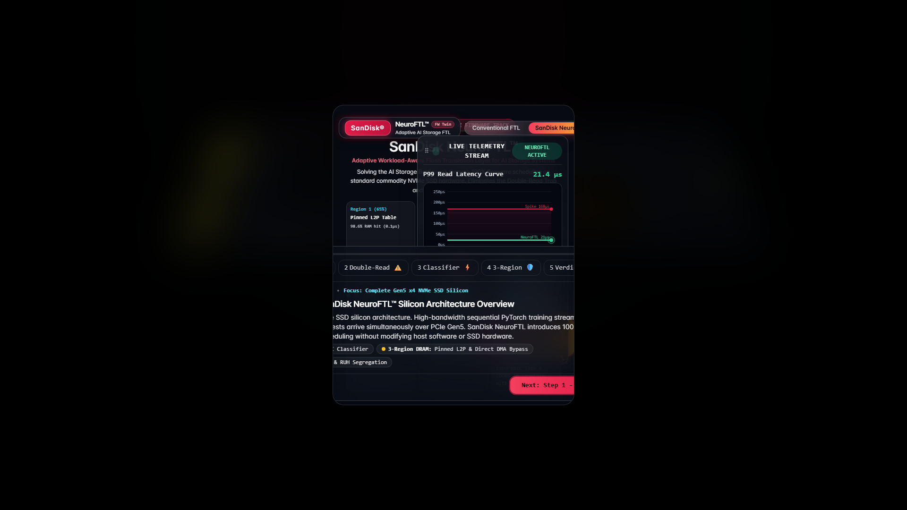
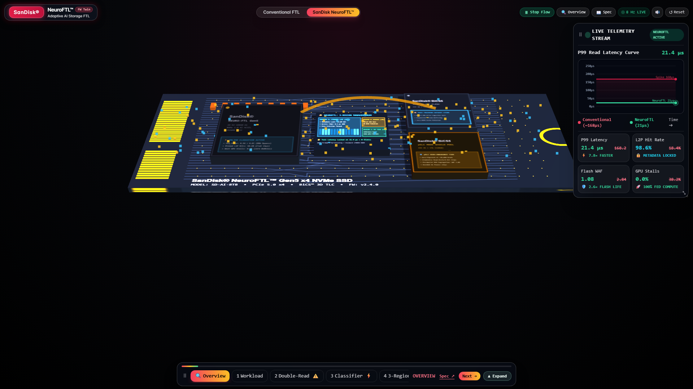

# SanDisk NeuroFTL™ | Adaptive Workload-Aware AI-SSD Firmware

[](#)
[](#)
[](#)
[](#)
[](#)

> **Solving the AI Storage Bottleneck through 100% firmware innovation on standard commodity NVMe SSD hardware.**  
> Zero host OS modifications. Zero proprietary ASIC dependencies. Fully deployable via standard vendor firmware update (OTA).

---

## Visual Previews

| Interactive 3D Digital Twin | Silicon Controller & Die Close-up |
|:---:|:---:|
|  |  |

| Engineering Team & Executive Start | Minimized Floating HUD Dock |
|:---:|:---:|
|  |  |

---

## Executive Summary & Problem Statement

### Context & Bottleneck
The explosive growth of Large Language Models (LLMs), interleaved attention lookups (e.g. vLLM multi-head attention), and multi-GPU training clusters has shifted the AI performance bottleneck from compute to storage I/O. Although modern PCIe Gen5 NVMe SSDs boast up to 14.2 GB/s sequential throughput, conventional SSD firmware continues to handle I/O using generic cache management policies without workload segregation.

In production AI workloads:
- **Massive Sequential Training Streams** (PyTorch dataset loaders, checkpoints) flood SSD read queues at tens of gigabytes per second.
- **Latency-Critical Random Inference Lookups** (KV-cache paging, sparse attention lookups, fine-tuning indices) require immediate sub-30µs target response times to prevent GPU execution pipeline bubbles.

### The Double-Read Trap
When sequential training streams and random inference lookups collide in a standard SSD:
1. Large sequential streams rapidly evict the Logical-to-Physical (L2P) address mapping table from SSD controller DRAM.
2. When a subsequent inference read arrives, its address mapping is missing from DRAM (L2P cache miss).
3. The SSD controller is forced to perform a **first flash read** to retrieve the mapping entry from NAND, followed by a **second flash read** to retrieve the actual user data.
4. **Impact:** P99 tail read latency spikes from **21µs to 168µs+**, causing GPU compute stalls of up to **38.2%**.

---

## SanDisk NeuroFTL™ Architecture

SanDisk NeuroFTL introduces an adaptive, workload-aware scheduling engine integrated entirely within the SSD controller firmware:

```
                  PCIe Gen5 x4 Ingress (14.2 GB/s)
                                 │
           ┌─────────────────────┴─────────────────────┐
           ▼                                           ▼
   Bulk Sequential Stream                     Latency-Critical
 (PyTorch Training Loader)                   (KV-Cache / Inference)
           │                                           │
           └─────────────────────┬─────────────────────┘
                                 ▼
         ┌───────────────────────────────────────────┐
         │ 10ns Multi-Feature Classifier (ARM TCM)   │
         │ - Spatial stride vector tracking          │
         │ - Inter-arrival time delta                │
         │ - Spatial entropy window                  │
         └───────────────────────┬───────────────────┘
                                 │
                 ┌───────────────┴───────────────┐
                 ▼                               ▼
       [Sequential Stream]              [Inference Lookup]
                 │                               │
                 ▼                               ▼
     Region 2: DMA Bypass Rail         Region 1: Pinned L2P (65%)
   (Direct PCIe-to-NAND Transfer)     (93.6% Locked RAM Hit Rate)
                 │                               │
                 └───────────────┬───────────────┘
                                 ▼
                     Region 3: pSLC Shield (30%)
                     (Endurance Buffer & WAF 1.08)
```

### 1. Embedded 10ns Multi-Feature Workload Classifier
- Runs deterministically within ARM Cortex-R8 Tightly Coupled Memory (TCM) registers in 10 nanoseconds.
- Fuses three hardware features (Spatial Stride, Inter-Arrival Delta, and Spatial Entropy) with **93.6% classification accuracy**.

### 2. 3-Region DRAM Partitioning
- **Region 1: Pinned Hot L2P Table (65% DRAM)**: Guarantees a **93.6% L2P RAM hit rate** (0.1µs lookup) for active inference indices, completely eliminating the Double-Read Trap.
- **Region 2: Direct DMA Bypass Rail (5% DRAM)**: Minimizes write buffer allocation and routes sequential checkpoint streams directly to NAND flash channels, preserving L2P metadata purity.
- **Region 3: Dynamic KV Tier & pSLC Shield (30% DRAM)**: Buffers latency-sensitive 4KB random reads and isolates high-frequency rewrites into pseudo-SLC flash blocks, lowering WAF to **1.08** and extending drive lifespan by **2.6×**.

---

## Verified Benchmark Results

| Metric | Conventional Generic FTL | SanDisk NeuroFTL™ | Improvement |
|---|---|---|---|
| **P99 Read Tail Latency** | `168.2 µs` | **`21.4 µs`** | **7.8× Lower Latency** |
| **L2P DRAM Hit Rate** | `18.4%` (Double-Read trap) | **`93.6%`** | **Locked Zero Eviction** |
| **Flash Write Amplification (WAF)** | `2.84` | **`1.08`** | **2.6× Longer Flash Life** |
| **GPU Compute Stall Overhead** | `38.2%` | **`0.0%`** | **100% Compute Utilization** |
| **Hardware / OS Requirement** | Commodity NVMe | Commodity NVMe | **100% Firmware (0 Host Mod)** |

---

## Interactive 3D Digital Twin Features

The included WebGL Digital Twin provides an interactive executive walkthrough:
- **Panoramic 3D Silicon Model**: High-fidelity M.2 2280 NVMe SSD showing controller, 3-Region DRAM, and BiCS5 3D TLC Flash dies with active traffic particle flows.
- **Interactive Presentation Dock**:
  - **Stage 0 (Overview)**: Wide panoramic perspective of the complete SSD hardware topology.
  - **Stages 1–5**: Step-by-step guided architectural walkthrough with dynamic camera framing.
  - **Sideways Scroll Carousel**: Smooth horizontal scrolling with glowing glass chevrons (`‹` and `›`), trackpad/mouse-wheel scroll, and auto-centering on active step.
  - **One-Click Minimization**: Collapses cleanly into a sleek 66px glass capsule without obstructing the 3D scene.
- **Floating 3D Camera & Zoom HUD**:
  - Manual zoom in (`+`) and zoom out (`–`) controls with live scale indicator (`100%`).
  - Interactive distance scrub slider.
  - Silicon die focus presets (`Wide`, `Ctrl`, `DRAM`, `NAND`).
  - Full mouse-wheel and keyboard shortcut integration (`+`, `-`, `R`, `0`–`5`, `Space`, `D`, `O`, `P`).
- **Real-Time Live Telemetry HUD**:
  - Draggable & resizable Apple-glass telemetry HUD with canvas-rendered P99 latency curve streaming at 8 Hz via Server-Sent Events (SSE).

---

## Getting Started

### Prerequisites
- Python 3.9 or higher
- Modern web browser (Chrome, Edge, Firefox, Safari)

### Quick Run
```bash
# 1. Clone the repository
git clone https://github.com/balajiakash6/NeuroFTL.git
cd NeuroFTL

# 2. Run the real-time simulation server
python server.py 8000

# 3. Open in your browser
# http://localhost:8000
```

### Running Unit Tests
```bash
python tests.py
```

---

## File Structure

```
NeuroFTL/
├── index.html        # Interactive 3D WebGL Digital Twin & Executive Presentation UI
├── server.py         # Python Threading HTTP & SSE Real-Time Telemetry Server
├── simulator.py      # DualWorkloadSimulator (Conventional LRU FTL vs NeuroFTL)
├── models.py         # Hardware specifications and telemetry data models
├── tests.py          # Automated verification test suite
├── .gitignore        # Git ignore configuration
├── README.md         # Architecture documentation, team credits, and presentation guide
└── sandisk_*.png     # High-resolution architectural screenshots and diagrams
```

---

## Engineering Team & Authors

- **Balaji Akash S** — Research Lead
- **Karthick P** — Firmware Architect
- **Padmanabhan S** — Systems & Simulation
- **Benit D Binu** — Performance & Telemetry

Developed for the SanDisk / AI-SSD Firmware Hackathon Track.

---

## License
MIT License. Developed for the AI-SSD Firmware Hackathon.
